# ABB Motion Program Exec Robot Setup using RobotWare Add-In

ABB Motion Program Exec requires software to be installed on the robot. This software can be
installed manually by copying files to the robot controller and importing configuration files,
or by using a RobotWare Add-In. The RobotWare Add-In is cleaner and probably more reliable,
but is also less flexible and requires using the Installation Manager which can be confusing.
This documents covers using the RobotWare Add-In for a virtual controller in Robot Studio. See
robot_setup_manual.md for manual setup instructions.

## Step 1: Install Add-In and RobotWare 6.13

**This section only needs to be completed once on RobotWare installation.**

Begin by installing and starting RobotStudio. See 
http://new.abb.com/products/robotics/robotstudio/downloads for downloads.

Once installed, open RobotStudio and click on the "Add-Ins" tab on the top of the window.

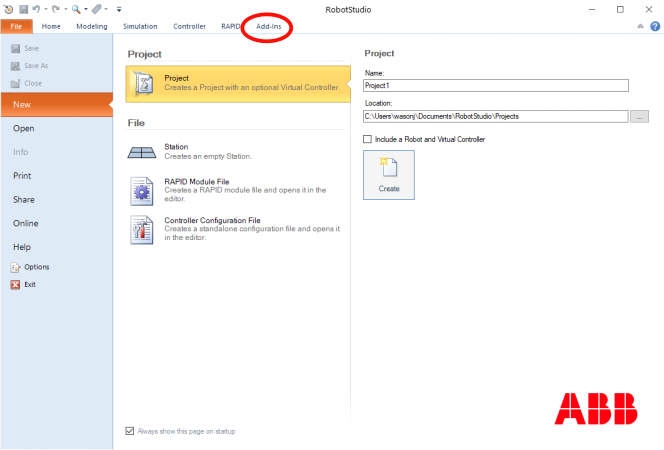

First, install the newest version of RobotWare 6.13 for IRC5 controllers. Versions greater 
than RobotWare 6.13 may work, but they have not been tested. In the "RobotApps" -> "Gallery" window,
select RobotWare for IRC5. On the right, select "Version" to be the greatest version of 6.13.
In this example, version 6.13.01 is the greatest version available. Click "Add", accept the next
window, and wait for the installation to finish.

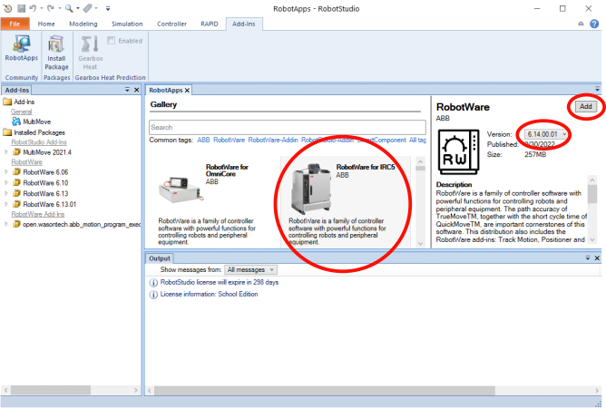

Next, install the motion program exec add-in. The package is located in this repository under

```
<repo_root>/robot/robotware_addin/abb_motion_program_exec_robotware/abb_motion_program_exec_robotware_<version>/open.wasontech.abb_motion_program_exec_robotware_<version>.rmf
```

where *version* may change over time. Click "Install Package" on the RobotStudio Add-Ins page.

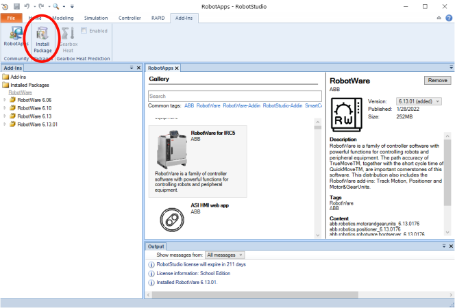

Select the `.rmf` file above using the file browser.

The new add-in should now be visible under the Add-Ins tree.


RobotStudio is now ready to create a solution with the add-ins.

## 2. Create Solution and Install Robot

Click on the "File" tab, and then "Solution with Station and Virtual Controller". Select the 
RobotWare version installed in Step 1, in this case "6.13.01.00". For this example, the 
"IRB 1200 5kg 0.9m" robot is used. Any 6 or 7 axis single-arm robot can be used instead. Change
the "Solution Name" if desired. Click "Create" when ready.


If a window "Select library for '1200.09_5_TypeB (ROB_1)" appears, select "IRB1200_5_90_STD_03" 
and click "OK".


Check which model the "real" robot is if using a robot other than IRB1200. Normally the "STD"
version is fine for simulation. **The variant in terms of reach and payload is very important.** The
other options often don't affect simulation.

Now use installation manager to install the add-in. Click on the "Controller" tab -> "Installation
Manager" -> "Installation Manager 6".

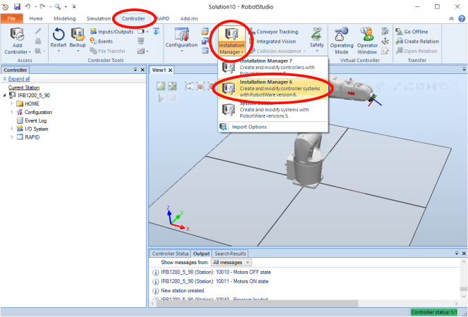

The installation manager will open, and will show a list of available controllers. If no controllers
are visible, click "Refresh" a few times. Select the controller created when the solution
was created. In this case, the controller name is "IRB1200_5_90". It is specified by the 
"Controller" -> "Name" on the new solution page. Click "Next".

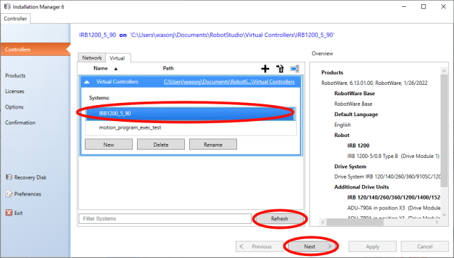

On the next page "Added Product(s)", click "Add.."

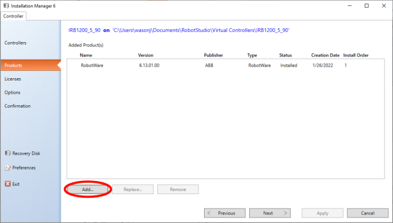

Select "abb_motion_program_exec_robotware" and click "OK".


Click "Next" on the Licenses page, using the default "VIRTUAL_USE" license. If installing
on a real robot, this will need to be updated. The abb_motion_program_exec does not require a
license.

On the "Options" page, select the "Applications" tab, and scroll to the bottom. Expand under 
"Wason Technology" -> "Remote Motion Control" -> and check "Motion Program Exec".

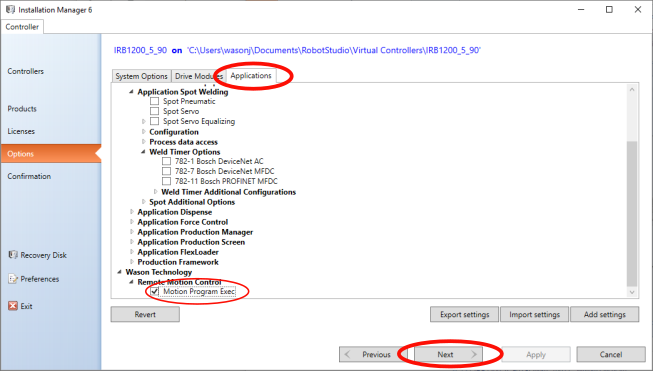

The next window will give a summary of the selected options. Click "Apply". When asked
if you want to continue, click "Yes". Click "OK" when told "The changes will not take effect
until the virtual system has been reset."

Close the installation manager.

Click "Restart" on the "Controller" ribbon.

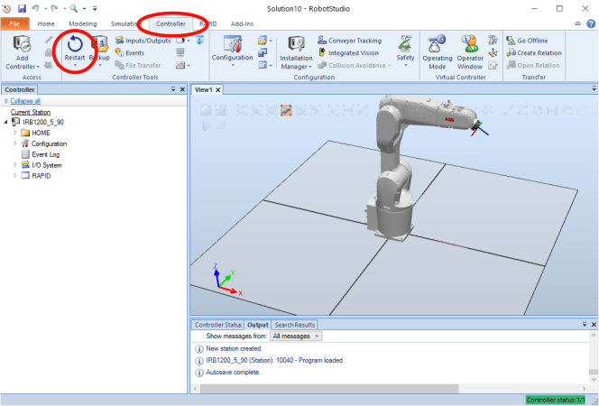

The add-in will initialize by installing several files to "HOME", initializing tasks, and setting
several options. The following should match, and can be checked against your system to verify 
installation:


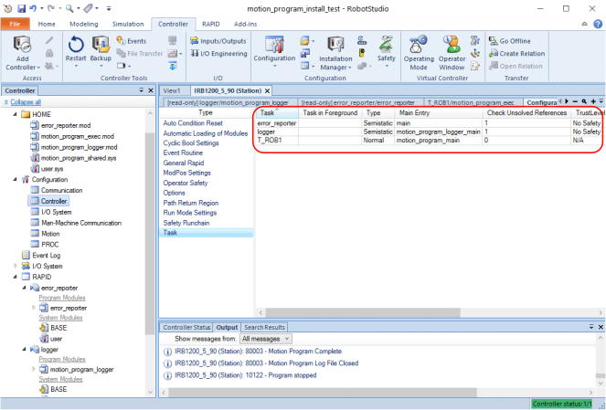


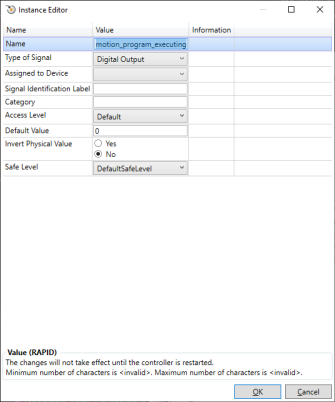


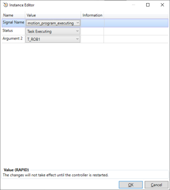

## 3. Run Programs

The robot is now ready to run programs! The `abb_motion_program_exec_client.py` can either
be imported to be used as a python module, or can be run directly to run an example
motion sequence.

```
python abb_motion_program_exec_client.py
```

On Linux, it may be necessary to run `python3`

```
python3 abb_motion_program_exec_client.py
```

By default, the virtual controller listens on `http://localhost:80` for requests. The Python
module uses ABB WebServices for communication.

## 4. Update Add-In Version

To update the Add-In, first close all solutions and start RobotStudio without opening a solution.
Click on the "Add-Ins" tab on the top to open the Add-Ins page. Right click on 
"open.wasontech.abb_motion_program_exec_robotware" in the left Add-Ins tree, and click 
"Uninstall Package". Repeat the installation steps for the Add-In from Step 1.
